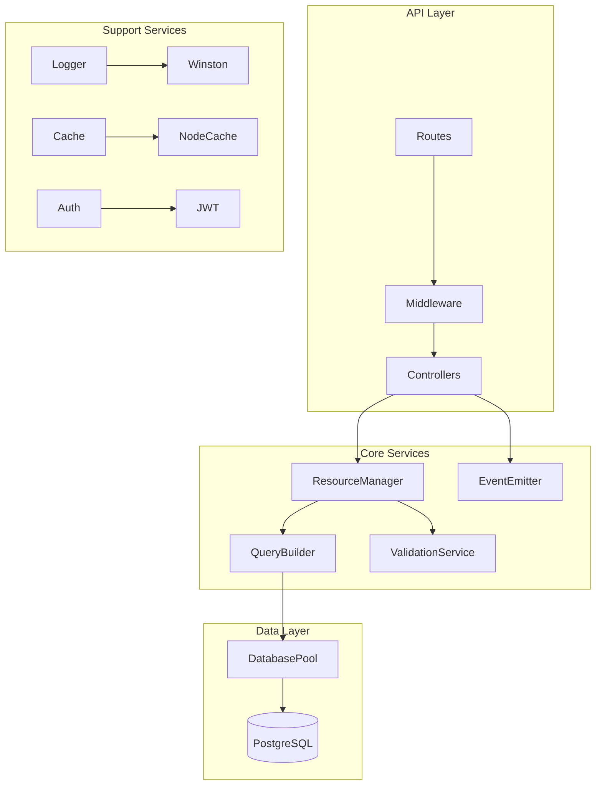

# Backend Architecture

## System Overview

## System Architecture Diagram

## Data Flow Diagram

## Database Schema

## Component Architecture

## System Overview
- Node.js/Express backend service
- PostgreSQL database with connection pooling
- JWT-based authentication
- Event-driven architecture using custom EventEmitter

## Core Components

### API Layer
- Express routers for resource endpoints
- Request validation middleware
- Rate limiting and timeout protection
- Standardized response formatting

### Database Layer
- Connection pooling with pg
- Query builder for safe SQL construction
- Transaction support
- Migration management

### Authentication System
- Google OAuth integration
- JWT token management
- Role-based access control
- Session handling

### Resource Management
- Generic ResourceManager class
- Ownership validation
- Access control
- Event emission on changes

## Data Flows

### Request Pipeline
1. CORS & basic middleware
2. Authentication verification
3. Request validation
4. Resource access control
5. Business logic execution
6. Response formatting

### Event System
- Event emission on resource changes
- Logging integration
- Async operation handling
- Error tracking

## Extension Points

### Adding New Resources
1. Create migration file
2. Add route handler
3. Define validation schema
4. Implement ResourceManager
5. Register routes

### Custom Middleware
- Request validation
- Error handling
- Rate limiting
- Logging

## Security Considerations

### Authentication
- JWT token validation
- OAuth2 integration
- Session management
- CORS configuration

### Data Protection
- Input validation
- SQL injection prevention
- XSS protection
- Rate limiting

### Error Handling
- Centralized error processing
- Environment-based error details
- Secure error responses
- Logging strategy

## Performance Optimizations

### Database
- Connection pooling
- Query optimization
- Index management
- Transaction handling

### Caching
- Response caching
- Query result caching
- Session caching
- Rate limit tracking

### Resource Management
- Request timeouts
- Rate limiting
- Pool size management
- Query optimization

## Deployment Architecture

### Process Management
- PM2 configuration
- Cluster mode
- Auto-restart
- Log rotation

### Monitoring
- Error tracking
- Performance metrics
- Resource usage
- Health checks

### Scaling Strategy
- Horizontal scaling
- Load balancing
- Database sharding
- Cache distribution

## Related Documentation
- [README](README.md) - Project overview and setup
- [User & Developer Guide](DOCUMENTATION.md) - Installation and usage
